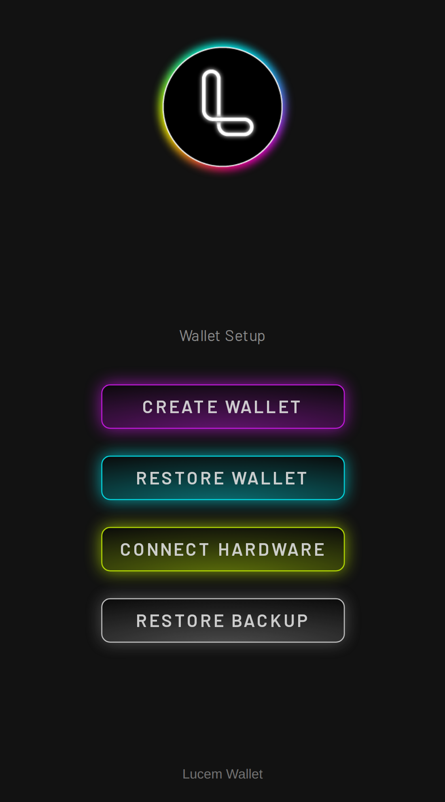
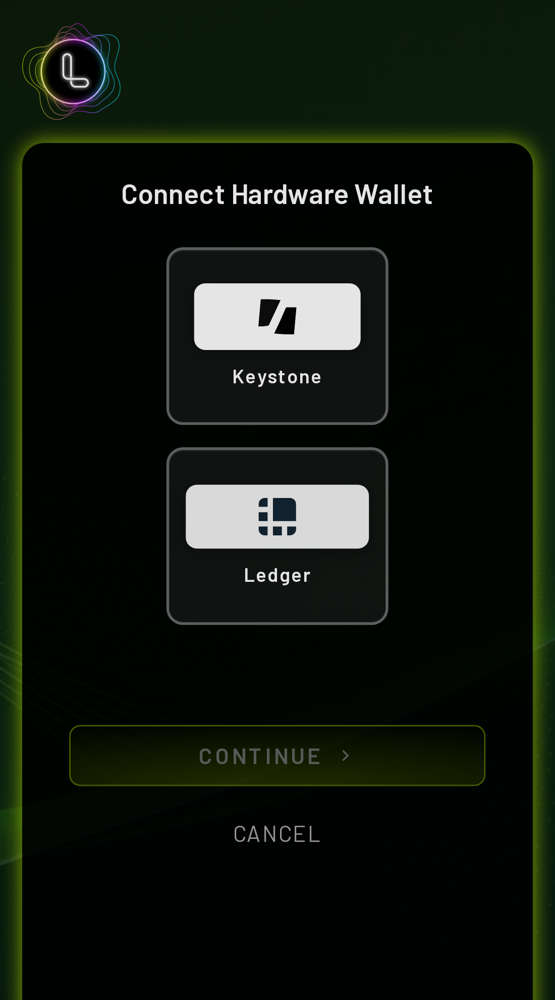
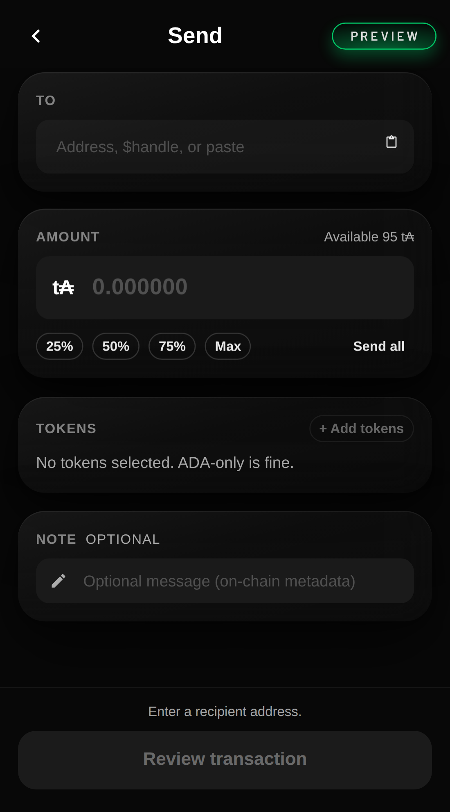
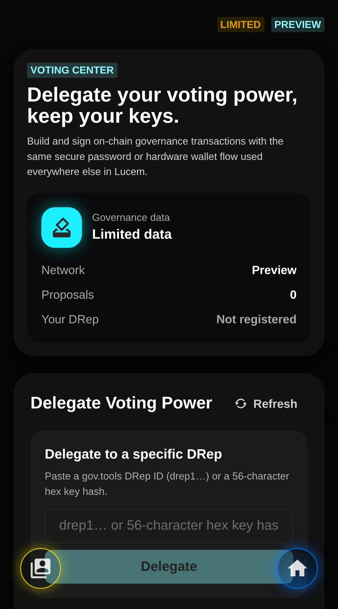

<p align="center"></p>

# Lucem

Lucem is an open-source Cardano wallet: a Chrome/Firefox/Edge **extension**, a **web app**, and a Capacitor **mobile** shell. It is forked from [Nami](https://iohk.io/en/blog/posts/2023/11/01/nami-has-a-new-home/). Settings expose **Mainnet**, **Preprod**, and **Preview**. dApps connect through CIP-30 under `window.cardano.lucem` (Mesh and gov.tools already do); CIP-95 is opt-in at `enable()` time.

<p align="center">
  
  
  
  
</p>

## Features

- **CIP-30 dApp connector** — namespace `lucem`; addresses are hex-encoded Address CBOR
- **CIP-95** — DRep / stake-key methods when you `enable({ extensions: [{ cip: 95 }] })`
- **Hardware wallets** — Keystone (QR), Ledger (USB / Bluetooth), Trezor (signing)
- **Networks** — Mainnet, Preprod, Preview (same three choices as Settings)
- **Send, receive, native tokens, staking, governance**
- **Runs as** a browser extension, `localhost:3000/mainPopup.html`, or [mobile](MOBILE.md)

## Install

### Browser extension

1. Download the zip from the latest [Release](https://github.com/Fuma419/lucem-wallet/releases) and extract it.
2. Open `chrome://extensions` (or the equivalent on Firefox / Edge).
3. Enable Developer mode → **Load unpacked** → select the `build/` folder.

### Web app

```bash
npm start
```

Open [http://localhost:3000/mainPopup.html](http://localhost:3000/mainPopup.html). Webpack also writes `build/` on disk, so you can load that folder as an unpacked extension while developing.

### Mobile (iOS / Android)

See **[MOBILE.md](MOBILE.md)** for Capacitor setup, Keystone QR on device, and store notes.

## Networks

Settings offers only these three. CIP-30 `getNetworkId()` returns `1` on Mainnet and `0` on Preprod and Preview.

| Network | Koios |
| ------- | ----- |
| **Mainnet** | `https://api.koios.rest/api/v1` |
| **Preprod** | `https://preprod.koios.rest/api/v1` |
| **Preview** | `https://preview.koios.rest/api/v1` |

Optional Koios API keys raise rate limits. Governance proposal text is richer with a matching Blockfrost project id (`BLOCKFROST_*` in `.env.example`); without it the Voting Center shows **Limited data**.

## CIP-30 for dApp authors

Provider: `window.cardano.lucem`. Spec: [CIP-30](https://github.com/cardano-foundation/CIPs/tree/master/CIP-0030), [CIP-95](https://github.com/cardano-foundation/CIPs/tree/master/CIP-0095).

**Addresses are hex**, not bech32. `getChangeAddress()`, `getUsedAddresses()`, and `getRewardAddresses()` return hex-encoded Address CBOR (`cip30-address.js`). Mesh, Eternl, and Lace speak hex; treating those strings as `addr1…` / `addr_test1…` will break change-address and stake-certificate builders.

`getCollateral()` is on the **standard** CIP-30 API returned from `enable()` (not `api.experimental`). CIP-95 is **not** attached unless you request it.

```javascript
const lucem = window.cardano?.lucem;
if (!lucem) {
  throw new Error('Lucem is not available. Install the extension or open the Lucem web app.');
}

const api = await lucem.enable({
  extensions: [{ cip: 95 }],
});

const networkId = await api.getNetworkId(); // 1 = Mainnet, 0 = Preprod or Preview
const changeHex = await api.getChangeAddress(); // hex Address CBOR, not bech32
const usedHex = await api.getUsedAddresses();
const collateral = await api.getCollateral(); // standard CIP-30

console.log(await api.getExtensions()); // [{ cip: 95 }]
const dRepKey = await api.cip95.getPubDRepKey();
const registered = await api.cip95.getRegisteredPubStakeKeys();

api.on('accountChange', (addresses) => {
  /* hex addresses */
});
api.on('networkChange', (id) => {
  /* 0 or 1 */
});
```

`enable()` without `{ extensions: [{ cip: 95 }] }` still returns the full CIP-30 surface (`getCollateral`, `getExtensions` → `[]`, …) but **no** `api.cip95`. `getUnusedAddresses()` returns `[]`. `signData(address, payload)` is CIP-30 (hex address + hex payload → `{ signature, key }`).

A deprecated top-level `window.cardano.enable()` still exists for old sites; new integrations should use `window.cardano.lucem` only.

## Hardware wallets

The Connect Hardware Wallet screen offers **Keystone** and **Ledger**.

- **Keystone** — air-gapped QR (also the hardware path on mobile).
- **Ledger** — USB or Bluetooth (Chrome / Edge on desktop; iOS browsers do not expose Web Bluetooth).
- **Trezor** — signing flow for Trezor accounts (`trezorTx`).

## Development

**Node 24.x** (`.nvmrc` is `24.19.0`; `package.json` `engines.node` is `24.x`).

```bash
nvm use
NODE_ENV=development npm install
cp secrets.testing.js secrets.development.js
cp secrets.testing.js secrets.production.js
npm start
```

`secrets.*.js` (except `secrets.testing.js`) are gitignored; webpack resolves `import secrets from 'secrets'` to `secrets.{NODE_ENV}.js`. Copy the testing template so local builds have dummy keys.

Optional env (see `.env.example`): `KOIOS_API_KEY_MAINNET` / `_PREPROD` / `_PREVIEW`, and `BLOCKFROST_*` for governance metadata.

```bash
NODE_ENV=test npx jest    # unit tests
```

Do not paste recovery phrases, private keys, or passwords into issues or this repo. See **[SECURITY.md](SECURITY.md)**.

## License

[Apache-2.0](LICENSE)
